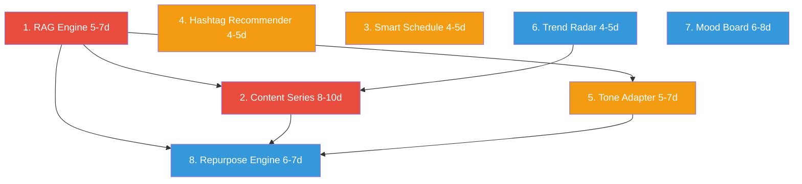

# Aromara: Feature Roadmap
*Версия: 2026-03-22 | Сгенерировано: Claude Code Multi-Agent (9 субагентов)*

## Context

Aromara — Telegram Mini App для аромаэкспертов. Текущая платформа зрелая: 30+ AI-агентов, 26 API роутеров, 23 DB модели, 5 форматов контента (carousel/reels/threads_series/instagram/telegram), trend aggregation из 10+ источников, publishing через Upload-Post SDK. Roadmap описывает 8 новых фич для перехода от инструмента создания контента к полноценной AI-платформе контент-маркетинга в wellness-нише.

**Общий объём:** 8 фич, ~43-57 дней разработки, 8 спринтов (2-недельных).

---

## Архитектурный контекст

**Что нужно подготовить перед стартом:**
- Проверить RAM на VPS (2GB может быть недостаточно для sentence-transformers + FAISS)
- Убедиться что Instagram Business/Creator account подключен (для Smart Schedule)
- Подготовить seed data: 200-300 wellness хэштегов, 20-30 botanical family -> color mappings

**Новые зависимости (pip):** `faiss-cpu`, `sentence-transformers`

**Новые DB таблицы:** `series`, `audience_insights`, `hashtags`, `trend_cards`, `repurpose_groups`

**Изменения существующих таблиц:** `DraftModel` + `series_id`, `series_position`

---

## Сводная таблица фичей

| # | Фича | Приоритет | Сложность | Дней | Зависимости | Риск |
|---|------|-----------|-----------|------|-------------|------|
| 1 | AI Content Writer с RAG | P0 | L | 5-7 | — | RAM на VPS, качество embeddings для RU |
| 2 | Content Series | P0 | XL | 8-10 | RAG (опционально) | Время генерации 7 постов, связность |
| 3 | Smart Schedule | P1 | M | 4-5 | Business account Instagram | Ограничения Insights API |
| 4 | Hashtag Recommender | P1 | M | 4-5 | — | Rate limits IG API (30/7 дней) |
| 5 | Tone Adapter | P1 | L | 5-7 | — | Потеря фактов при смене тона |
| 6 | Trend Radar | P2 | M | 4-5 | Существующий trend pipeline | Качество AI-карточек |
| 7 | Visual Mood Board | P2 | L | 6-8 | Carousel agent | Субъективность палитр |
| 8 | Repurpose Engine | P2 | L | 6-7 | Все generation pipelines | Параллельная нагрузка на Claude |

**Итого: 43-54 дня**

---

## Критический путь

**Минимальная последовательность для P0:** RAG → Content Series (13-17 дней).

---

## Спринт-план

### Спринт 1-2 (4 недели): Фундамент + P0

**Цель:** RAG-движок + Content Series — ядро AI-платформы.

**Спринт 1 (дни 1-10):**
- [ ] RAG Engine: `bot/services/rag/` — embeddings, indexer, retriever (FAISS + sentence-transformers)
- [ ] RAG интеграция в content pipeline (`miniapp/api/generation/content.py`)
- [ ] API: `GET /api/rag/search`, `GET /api/rag/status`
- [ ] Frontend: блок "Релевантные знания" в create.js
- [ ] Тесты RAG + VPS deploy проверка RAM
- **DoD:** генерация контента использует RAG-контекст, семантический поиск работает по всем 600+ карточкам

**Спринт 2 (дни 11-20):**
- [ ] DB: `SeriesModel` + миграция + `series_store.py`
- [ ] Agents: `series_orchestrator.py`, `series_editor.py`, `series_prompts.py`
- [ ] API: 10 endpoints `/api/series/*` + `/api/generate/series`
- [ ] Frontend: `series.js` — создание, timeline, approval
- [ ] 5 шаблонов серий в `data/series_templates.json`
- **DoD:** пользователь создает серию 5-7 постов из шаблона, видит progress, утверждает, планирует расписание

### Спринт 3-4 (4 недели): P1 фичи

**Цель:** Hashtag + Tone + Schedule — усиление контент-пайплайна.

**Спринт 3 (дни 21-30):**
- [ ] Hashtag: `HashtagModel` + seed 200-300 тегов + `hashtag_recommender.py`
- [ ] Hashtag API: `POST /api/hashtags/recommend`, UI чипы в drafts.js
- [ ] Tone: `tone_adapter.py` + `tone_prompts.py` + 4 определения тонов
- [ ] Tone API: `POST /api/drafts/{id}/tone/adapt`, UI переключатель в drafts.js
- **DoD:** хэштеги рекомендуются по тексту с mix strategy, тон переключается с side-by-side preview

**Спринт 4 (дни 31-40):**
- [ ] Schedule: `AudienceInsightModel` + `audience_insights_collector.py`
- [ ] Schedule: `schedule_recommender.py` + `schedule_advisor.py` (Claude reasoning)
- [ ] Schedule API: `GET /api/schedule/recommend`, UI виджет в schedule flow
- [ ] Heatmap активности аудитории в settings
- [ ] Интеграция Tone в content generation (tone при создании, не только rewrite)
- **DoD:** 3 лучших слота рекомендуются при планировании, heatmap показывает active hours

### Спринт 5-6 (4 недели): P2 фичи (часть 1)

**Цель:** Trend Radar + Repurpose Engine — автоматизация контент-маркетинга.

**Спринт 5 (дни 41-50):**
- [ ] Trend Radar: `TrendCardModel` + `trend_card_generator.py` + `trend_alerting.py`
- [ ] API: `GET /api/trends/cards`, `POST /api/trends/create-from-trend`
- [ ] Frontend: Trend Cards подтаб + detail + кнопка "Создать контент"
- [ ] n8n: step "generate cards" после enrichment
- **DoD:** ежедневно генерируются 5-10 trend cards, один клик создает draft из тренда

**Спринт 6 (дни 51-60):**
- [ ] Repurpose: `RepurposeGroupModel` + `repurpose_agent.py`
- [ ] Orchestration: `miniapp/api/generation/repurpose.py` — параллельный запуск existing pipelines
- [ ] API: `POST /api/repurpose/start`, group status, batch approve
- [ ] Frontend: `repurpose.js` — format picker, progress, batch review
- **DoD:** из одного поста создаются carousel + reels + threads_series, batch approval работает

### Спринт 7-8 (4 недели): P2 фичи (часть 2) + Polish

**Цель:** Mood Board + интеграция + полировка.

**Спринт 7 (дни 61-70):**
- [ ] Mood Board: `palette_mapper.py` + `palette_rules.json` (botanical family -> colors)
- [ ] `mood_board_agent.py` (Claude reasoning) + `mood_board_renderer.py` (Pillow PNG)
- [ ] API: `POST /api/mood-board/generate`, `POST /api/mood-board/apply-to-draft`
- [ ] Frontend: `mood_board.js` — generation, preview, apply to carousel
- [ ] Carousel integration: применение палитры к slides
- **DoD:** из масла/бленда генерируется палитра + PNG mood board, применяется к карусели

**Спринт 8 (дни 71-80):**
- [ ] Export: палитра → CSS / JSON для Canva
- [ ] Trend history charts (line chart velocity за 30 дней)
- [ ] Cross-feature интеграция: RAG → Series, Trends → Series, Tone → Repurpose
- [ ] E2E тесты всех новых flows
- [ ] Performance audit + VPS RAM optimization
- [ ] Проверка всех фич в 6 темах
- **DoD:** все 8 фич работают вместе, VPS стабилен, все тесты зеленые

---

## Фичи: Технические планы

### P0: Feature 1 — AI Content Writer с RAG

**Архитектура:** FAISS-based векторный индекс поверх существующих данных в SQLite. Embedding model `paraphrase-multilingual-MiniLM-L12-v2` (384-dim, мультиязычная). Один документ = одна карточка (масло/бленд/симптом). При генерации контента: embed query → FAISS top-K → fetch full cards from SQLite → inject в prompt.

**Ключевое решение:** FAISS (не pgvector, не ChromaDB) — in-process, zero-ops, ~50MB файл индекса. Проект на SQLite, переход на Postgres — отдельный scope.

**Уже существует:** `build_reference_context()` в `bot/services/miniapp_references/common.py` — keyword matching. RAG заменит семантическим поиском.

**Новые файлы:**
- `bot/services/rag/embeddings.py` — загрузка модели, encode
- `bot/services/rag/indexer.py` — build/rebuild FAISS индекса из DB
- `bot/services/rag/retriever.py` — query → top-K results
- `miniapp/api/routers/rag.py` — `GET /api/rag/search`, `GET /api/rag/status`
- `scripts/rebuild_faiss_index.py` — standalone rebuild

**Модифицируемые файлы:**
- `bot/agents/prompts/content_prompts.py` — RAG context block
- `miniapp/api/generation/content.py` — вызов retriever перед генерацией
- `miniapp/static/js/create.js` — UI "Релевантные знания"

**Риски:** RAM на VPS (~800MB для sentence-transformers), startup time (10-15s cold load), качество RU embeddings для domain-specific терминов. **Fallback:** существующий keyword matching.

---

### P0: Feature 2 — Content Series

**Архитектура:** Новая модель `SeriesModel` связана с дочерними `DraftModel` через `series_id`. Каждый пост серии — отдельный Draft со своим lifecycle. Agent pipeline: Orchestrator (outline) → Writer batches (2-3 posts per call) → Coherence Editor.

**Ключевое решение:** Отдельная `SeriesModel` (не расширение DraftModel) — серия это мета-объект. Последовательная генерация с context threading (каждый пост знает о предыдущих).

**Уже существует:** `threads_series` (3 поста УТРО/ДЕНЬ/ВЕЧЕР) — proof-of-concept. Новая система обобщает до 5-7 постов любого формата.

**DB:** Таблица `series` (series_id, template_key, theme, goal_key, outline, post_count, status, schedule, generation_state). `DraftModel` + `series_id`, `series_position`.

**API (10 endpoints):** CRUD серии, regen-post, regen-all, coherence-check, approve, schedule, templates.

**5 встроенных шаблонов:** oil_of_week, seasonal_care, sound_meditation, blend_spotlight, symptom_journey.

**Position-aware prompts:** intro → middle → climax → CTA с контекстом предыдущих постов.

---

### P1: Feature 3 — Smart Schedule

**Архитектура:** 3 компонента: AudienceInsightsCollector (Instagram `online_followers` метрика), ScheduleRecommender (взвешенная формула), Claude ScheduleAdvisor (topic-time fit).

**Формула:** `score = 0.5 * audience_activity + 0.3 * historical_performance + 0.2 * topic_fit`

**Cold start:** жёстко прописанные wellness-niche слоты (ПН/СР/ПТ 09:00, 13:00, 19:00 MSK).

**DB:** `AudienceInsightModel` (platform, day_of_week, hour_utc, value).

**API:** `GET /api/schedule/recommend`, `POST /api/schedule/collect-insights`, `GET /api/schedule/audience-activity`.

**Frontend:** 3 лучших слота как кликабельные чипы при планировании + heatmap в settings.

---

### P1: Feature 4 — Hashtag Recommender

**Архитектура:** Seed DB (200-300 тегов с tier classification) + Claude Content Analyzer (текст → темы → матчинг) + Mix Strategy Engine (30% high / 40% medium / 30% niche).

**Ключевое решение:** конкурентность НЕ через Instagram API (лимит 30 unique/7 дней), а через предклассифицированные tiers в seed DB. Периодическое обогащение при наличии квоты.

**Уже существует:** `HashtagQuotaModel` для отслеживания квот, `keywords.py` router.

**DB:** `HashtagModel` (tag, language, category, tier, estimated_posts, relevance_score).

**API:** `POST /api/hashtags/recommend`, `GET /api/hashtags/library`, `POST /api/hashtags/apply`, `GET /api/hashtags/quota`.

**Frontend:** чипы с цветовой кодировкой tier (🟢high/🔵medium/🟣niche), one-click apply.

---

### P1: Feature 5 — Tone Adapter

**Архитектура:** ToneAdapterAgent (Claude rewriter) + tone definitions (4 тона с детальными характеристиками) + кэширование через DraftRevisionModel.

**Ключевое решение:** tone и goal — разные оси. Goal = цель поста, Tone = стиль изложения. НЕ мержим.

**4 тона:** educational (тезис→объяснение→пример→вывод), inspirational (образ→резонанс→расширение), selling (боль→агитация→решение→CTA), storytelling (завязка→конфликт→поворот→вывод).

**Storage:** `DraftRevisionModel` с `author="ai:tone:{key}"` — варианты как ревизии. Новых таблиц не нужно.

**API:** `POST /api/drafts/{id}/tone/adapt`, `GET /api/drafts/{id}/tone/variants`, `POST /api/drafts/{id}/tone/apply`.

**Frontend:** переключатель тонов в draft detail + side-by-side preview.

---

### P2: Feature 6 — Trend Radar

**Архитектура:** Надстройка поверх существующего trend pipeline. Claude генерирует structured TrendCards из enriched signals. Кнопка "Создать контент" pre-fills create flow.

**Уже существует (90% инфраструктуры!):** 14 коллекторов, enrichment pipeline, n8n workflows, `trends.js` (32KB), `/api/trends/trigger`.

**Что добавляется:** AI-синтез паттернов → TrendCards, trend-to-content bridge, alerting, history charts.

**DB:** `TrendCardModel` (keyword, title, strength, lifecycle, summary, examples, recommendation, suggested_formats, velocity, convergence).

**API:** `GET /api/trends/cards`, `POST /api/trends/create-from-trend`, `GET /api/trends/history/{keyword}`.

---

### P2: Feature 7 — Visual Mood Board

**Архитектура:** Двухуровневый маппинг: predefined rules (botanical family → base palette) + Claude refinement для сложных кейсов. Output: JSON palette + Pillow-rendered PNG preview.

**Новые файлы:** `palette_mapper.py`, `mood_board_agent.py`, `mood_board_renderer.py`, `data/palette_rules.json`.

**Интеграция:** палитра сохраняется в `DraftModel.payload.palette`, carousel re-renders с новыми цветами, image_prompt_engineer получает palette guidance.

**API:** `POST /api/mood-board/generate`, `POST /api/mood-board/apply-to-draft`, `GET /api/mood-board/presets`, `POST /api/mood-board/export`.

---

### P2: Feature 8 — Repurpose Engine

**Архитектура:** Orchestration layer поверх существующих generation pipelines. Agent извлекает core ideas → параллельно запускает carousel/reels/threads_series generators → batch preview + approval.

**Ключевое решение:** переиспользовать existing pipelines (НЕ unified pipeline). Каждый формат имеет специфичные правила. Repurpose = "адаптер" сверху.

**DB:** `RepurposeGroupModel` (source_draft_id, core_message, key_points, target_drafts, status).

**API:** `POST /api/repurpose/start`, `GET /api/repurpose/group/{id}`, batch approve.

**MVP без Stories** (нет текущего kind). 3 формата: carousel + reels + threads_series.

---

## Риски и митигация

| # | Риск | Вероятность | Импакт | Митигация |
|---|------|-------------|--------|-----------|
| 1 | **RAM на VPS** — sentence-transformers + FAISS могут потребовать >2GB | Высокая | Критичный | Проверить RAM перед стартом. Fallback: API embeddings (Replicate) вместо локальной модели. Или upgrade VPS |
| 2 | **Instagram API rate limits** — 30 hashtags/7d, insights только для Business | Средняя | Средний | Seed DB с ручной классификацией. Cold start defaults. Постепенное обогащение |
| 3 | **Время генерации серий** — 5-7 постов = 30-60 сек | Высокая | Средний | Batch generation (2-3 поста за вызов). Прогресс-бар. Background task |
| 4 | **Стоимость Claude API** — repurpose = 5 calls, series = 4 calls | Средняя | Средний | Tier gate (expert only). LlmCacheModel. Lazy generation |
| 5 | **Качество RU embeddings** — domain-specific термины | Средняя | Средний | A/B тестирование retrieval quality. Fallback на keyword matching |

---

## MVP для коммерческого запуска

Минимальный набор для версии с подпиской:

1. **AI Content Writer с RAG** (P0) — ключевая ценность: экспертный контент на основе базы знаний
2. **Content Series** (P0) — серии постов = reason to return
3. **Tone Adapter** (P1) — быстрая адаптация = экономия времени
4. **Hashtag Recommender** (P1) — нишевые хэштеги = конкурентное преимущество

**MVP = Спринты 1-3 (30 дней).** Остальные фичи — post-launch growth.

---

## Верификация

**Как тестировать каждую фичу:**

1. **RAG:** `.venv/bin/python -m pytest tests/test_rag.py` + manual: создать пост про лаванду → проверить что RAG подтянул карточку лаванды
2. **Series:** `.venv/bin/python -m pytest tests/test_series.py` + manual: создать серию "масло недели: лаванда" → 5 постов с связным нарративом
3. **Schedule:** manual: подключить Business IG account → собрать insights → проверить рекомендации
4. **Hashtag:** manual: ввести текст про ароматерапию → проверить mix 30/40/30 + tier badges
5. **Tone:** manual: взять draft → переключить 4 тона → side-by-side → проверить сохранение фактов
6. **Trend Radar:** manual: trigger trend collection → проверить trend cards → click "Создать контент"
7. **Mood Board:** manual: выбрать лаванду → сгенерировать palette → apply to carousel
8. **Repurpose:** manual: взять instagram post → repurpose → carousel + reels + threads → batch approve

**CI:** `.venv/bin/python -m pytest tests/ -q --ignore=tests/ui -n auto` + `.venv/bin/python -m pytest tests/ui/ -q`

---

## Следующий шаг

Создать директорию `docs/roadmap/`, сохранить этот план как `feature_plan.md`, и начать реализацию **Feature 1 (RAG Engine)** в режиме Software Factory: ветка `feature/rag-engine` → код → тесты → PR → merge → deploy.
